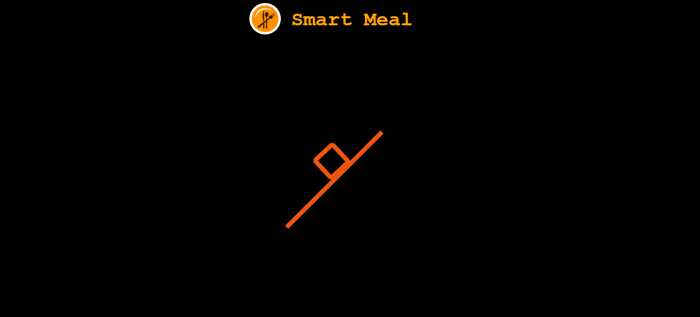

# 🥗 SmartMeal Planner

**Live Demo:** [https://smartmealbyajitha.netlify.app](https://smartmealbyajitha.netlify.app)

SmartMeal Planner is an AI-powered meal planning application that helps users generate a **7-day personalized meal plan** based on their health details, preferences, and dietary restrictions. It uses Groq's LLaMA 3 model to generate meal plans in real-time and displays the data in a user-friendly format.

---

## ✨ Features

- 🌿 **Personalized Meal Plans** — Tailored to user inputs like weight, height, age, allergies, goals, etc.
- 🧠 **AI-Powered** — Uses Groq's LLaMA-3.3-70B-Versatile model for generating JSON-based diet plans.
- 📊 **Table View** — Easy-to-read 7-day meal breakdown (Breakfast, Lunch, Dinner).
- 🖼️ **Image Carousel** — Rotating carousel of food images for visual appeal.
- 🔄 **Redux-Powered Form** — Persists user data with Redux for form state and navigation.
- 🚀 **Deployed on Netlify** — Fast and responsive experience.

---

## 📸 Screenshots

Loading screen


Form Details page


Groq Response


Rolling carousel

## 🛠️ Built With

- **React.js** (Functional Components & Hooks)
- **Redux Toolkit** (for global form state)
- **Groq SDK** (AI-generated meal plans using LLaMA model)
- **CSS Modules** for styling
- **Netlify** for deployment

---

## 🚀 Getting Started (Local Development)

### 1. Clone the repository

```bash
git clone https://github.com/<your-github-username>/smartmeal-planner.git
cd smartmeal-planner
```
### 2. Install dependencies
```bash
npm install
```

### Create .env file
Create a .env file in the root directory and add your Groq API key:

```
REACT_APP_GROQ_API_KEY=your_groq_api_key_here
```

⚠️ Groq API must support browser-based requests (dangerouslyAllowBrowser is used). Make sure your key has the right permissions.


### Start development server
```
npm start
```

### 🧪 How It Works
- User enters personal details (name, age, weight, height, dietary preference, etc.)

- Upon submission, data is saved in Redux and user is navigated to the /plans page.

- The app constructs a custom prompt and calls the Groq API to get a meal plan in JSON format.

- The response is parsed and rendered in a structured table.

- A bottom carousel keeps scrolling to showcase food images.

### 🧠 AI Prompt Template (Snippet)

You are a meal planner AI. You are given the following details...
Create a personalized meal plan for 7 days...
Respond with strictly a valid JSON:
```
{
  "meal_plan": {
    "monday": { "breakfast": {...}, "lunch": {...}, "dinner": {...} },
    ...
  }
}
```
### 🧩 Folder Structure
```
src/
├── components/
│   ├── Body.jsx         # Form component
│   ├── Result.jsx       # Displays meal plan from AI
│   ├── FoodCarousel.jsx # Image slider
│   ├── Loading.jsx      # Loading spinner
│   ├── Footer.jsx
├── utils/
│   └── UserDetails.js   # Redux slice
├── styles/              # CSS modules
│   ├── Body.css
│   └── Result.css
.env                     # Add your Groq key here
```

### 📦 Deployment
### The app is deployed on Netlify. To deploy your own version:

- Push code to GitHub.

- Connect repo to Netlify.

- Add REACT_APP_GROQ_API_KEY in Netlify Environment Variables.

- Hit deploy!

### 🙋‍♀️ Author
Rashika
Frontend Developer passionate about building AI-integrated user experiences.
# 📫 Connect with me on LinkedIn
[Rashika_Profile](https://www.linkedin.com/in/rashika-v-87b309150/)

